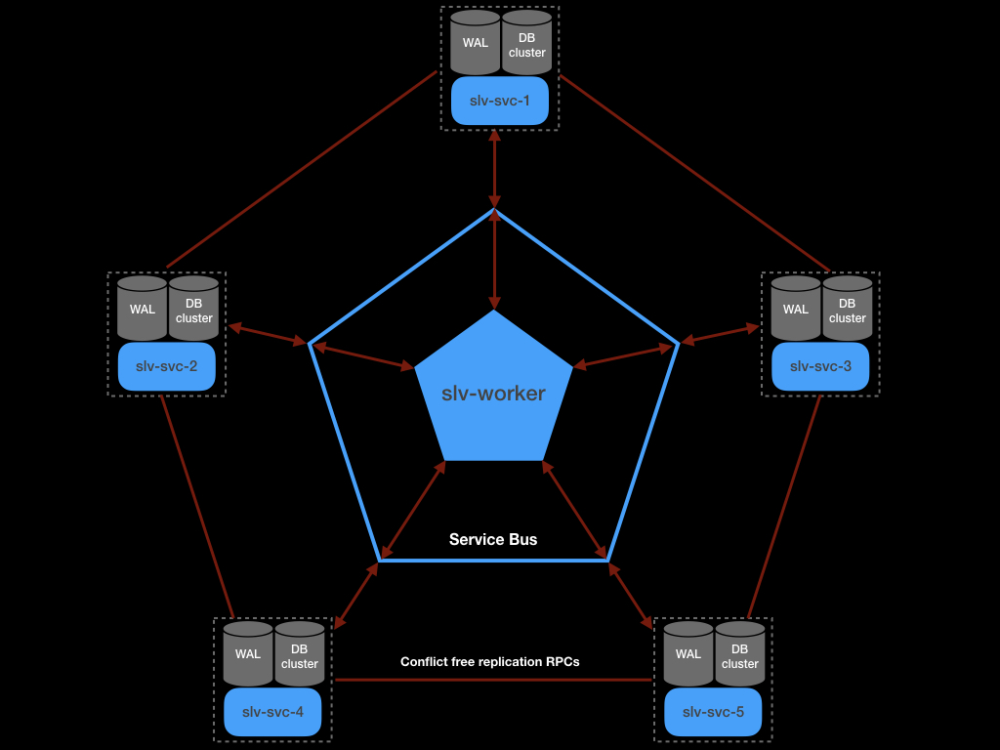
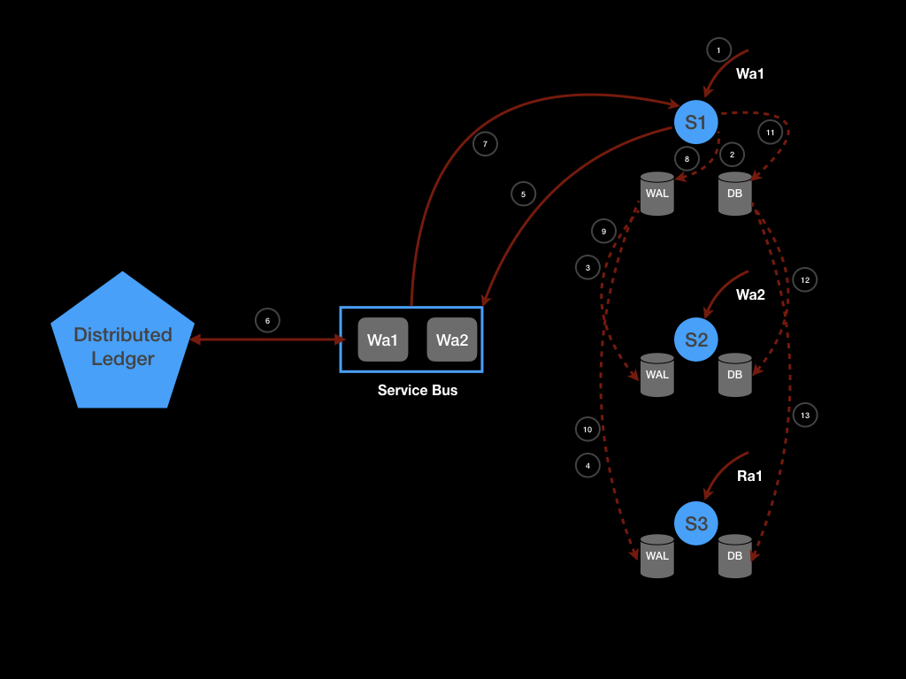
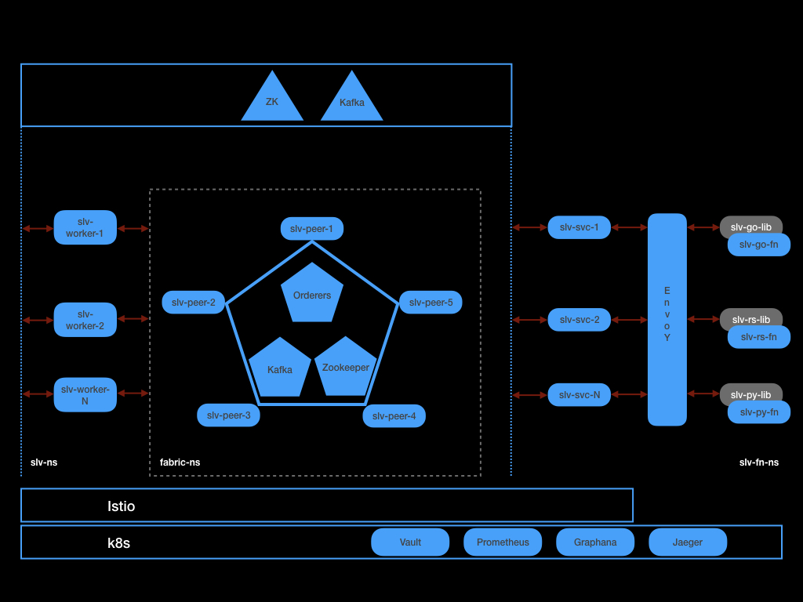

# slv-svc

### Goals
- Provide a reliable, secure & performant service to serverless functions(clients using slv-lib) to save state in a Blockchain. 
- Preserve the notion of threaded execution for the serverless function.
- Serialize writes to the Blockchain and resolve write conflicts(using Sequence CRDTs) in case multiple writes are performed by multiple clients.

### Overview

This repository strives to provide the goals outlines above to realise the instructions of the serverless ledger variable clients. All variables created by the user are cached in a DB cluster(local to the service), this is done to improve the read throughput of variables. However writes to a variable must go through blockchain consensus and so the throughput for writes is lower than reads.

The clients using [slv-go-lib](https://github.com/lprao/slv-go-lib) (or equivalent) can invoke this service via authenticated GRPC calls. To accomodate analytics use cases this repo will also provide an authenticated & secure REST apis to query serverless ledger variables(there are no POST/PUT apis to create/update variables).

slv-svc will serialize all user writes by employing sequential CRDT principles. Each instance of the service will employ a Write Ahead Log (WAL) to track each write and reconcile conflicts. The steps carried out by the write state meachine are shown below -

### Overview of Serverless Ledger Variables (SLV)

SLV provides a way for serverless functions to create and manage state. In addition to the usual properties such Type, Scope, Permissions; SLV provides -

- All writes to the state are performed when the Blockchain consensus is achieved.
- History of all changes to the state can be queried.

